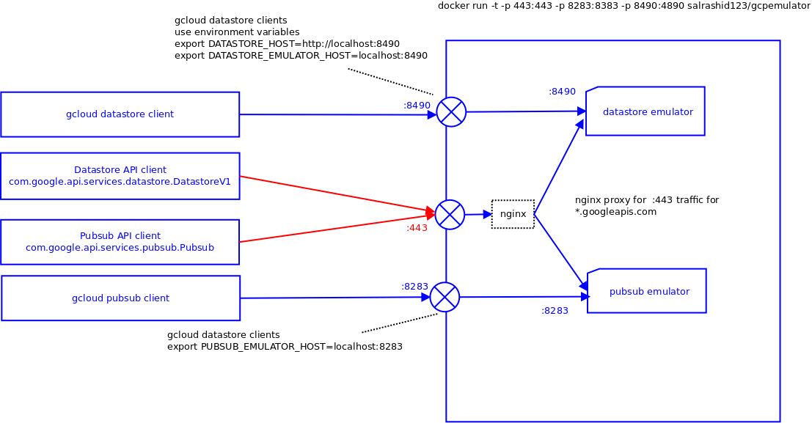

# gcpemulator
Proxy container for Google Cloud Platofrm pubsub and datastore emulators.


Also see
* [docker.io/salrashid123/gcpemulator](https://hub.docker.com/r/salrashid123/gcpemulator/)
* [https://github.com/SaMnCo/docker-pubsub-emulator](https://github.com/SaMnCo/docker-pubsub-emulator)
* [Google gcloud emulators](https://cloud.google.com/sdk/gcloud/reference/beta/emulators/)
* [gcloud-python](https://github.com/GoogleCloudPlatform/gcloud-python)
* [Google PubSub Libraries](https://cloud.google.com/pubsub/libraries)
* [Google Cloud Datastore Libraries](https://cloud.google.com/datastore/docs/getstarted/start_java/)
* [Cloud Datastore Local Development Server](https://cloud.google.com/datastore/docs/tools/devserver#connecting_your_app_to_the_local_development_server)

## Overview
Proxy server and container for GCP Cloud PubSub and Cloud Datastore emulators.  The container basically runs an nginx HTTPS proxy infront of the PubSub so that even direct references to pubsub.googleapis.com:443 are redirected to the emulator.

These emulators normally work with gcloud-python or gcloud-java libraries. For Cloud Datastore, the environment variables are directly loaded.  For pubsub, the environment variables are onl loaded when using 'gcloud libraries' (curated, idomatic libraries) but not with raw REST APIs (com.google.api.services.pubsub.Pubsub).  To use the emulator framework with com.google.api.services.pubsub.Pubsub, you need to redirect pubsub.googleapis.com:443 to the emulator on http.  The nginx proxy here performs the translation.





####Usage
To use, you need to
*  Change the DNS or /etc/hosts file to point pubsub.googleapis.com (and if using SSL proxy for datastore, www.googleapis.com)
*  Install the [CA_crt.pem](dockerimage/html/CA_crt.pem) to
** Java cacerts
** Python httplib cacerts.txt
** System (not recommended as you are overriding your system's trust store; most companies would frown on this)


**NOTE**  The proxy sends authentication headers to the proxy.  If you do not want to transmit the auth headers, you can override the access_token field before the API call.

You can also build the docker image from scratch instead of using prebuild *salrashid123/gcpemulator*

 
###DNS
Update DNS resolution for pubsub.googleapis.com

```
/etc/hosts
127.0.0.1  pubsub.googleapis.com

/etc/init.d/nscd restart
```


###JAVA

For java, you need to update the cacerts file used by the JRE (default password is 'changeit')

```
$JDK_HOME/jre/lib/security
keytool -keystore cacerts -importcert -alias testeso -file /tmp/CA_crt.crt

keytool -list -keystore cacerts
testeso, Feb 1, 2016, trustedCertEntry, 
Certificate fingerprint (SHA1): 32:DD:B7:7D:7C:5E:D3:93:22:2F:C4:44:B3:5D:28:E9:41:A8:96:2C
```

###PYTHON

```
virtualenv gcd
source gcd/bin/activate
pip install -r requirements.txt
```

Now you need to add the CA_cert.pem to the trust store for httplib2 (used by google api client library)
gcd/local/lib/python2.7/site-packages/httplib2/cacerts.txt

```
awk 'FNR==1{print ""}1' gcd/local/lib/python2.7/site-packages/httplib2/cacerts.txt ../dockerimage/html/CA_crt.pem > /tmp/cacerts.txt  && cp /tmp/cacerts.txt gcd/local/lib/python2.7/site-packages/httplib2/cacerts.txt
```


####CURL

To add the certifiate to the system truststore:
on debian:

```
cd /usr/share/ca-certificates/extra
cp /tmp/CA_crt.pem CA_crt.crt
dpkg-reconfigure ca-certificates
```

After this, you can use curl directly without cert warnings:
``` 
curl  -X PUT  https://pubsub.googleapis.com/v1/projects/p0/topics/t0

curl  -X GET  https://pubsub.googleapis.com/v1/projects/p0/topics
{
    "topics": [
        {
            "name": "projects/p0/topics/t0"
        }
    ]
}


```

### Sample output
```
sudo docker run -t -p  443:443 -p 8283:8283 -p 8490:8490 salrashid123/gcpemulator

2016-02-15 21:42:01,969 CRIT Supervisor running as root (no user in config file)
2016-02-15 21:42:01,969 WARN Included extra file "/etc/supervisor/conf.d/supervisord.conf" during parsing
2016-02-15 21:42:01,988 INFO RPC interface 'supervisor' initialized
2016-02-15 21:42:01,988 CRIT Server 'unix_http_server' running without any HTTP authentication checking
2016-02-15 21:42:01,989 INFO supervisord started with pid 1
2016-02-15 21:42:02,992 INFO spawned: 'nginx' with pid 7
2016-02-15 21:42:02,994 INFO spawned: 'datastore' with pid 8
2016-02-15 21:42:02,998 INFO spawned: 'pubsub' with pid 9
2016-02-15 21:42:03,993 INFO success: nginx entered RUNNING state, process has stayed up for > than 1 seconds (startsecs)
2016-02-15 21:42:03,993 INFO success: datastore entered RUNNING state, process has stayed up for > than 1 seconds (startsecs)
2016-02-15 21:42:04,175 INFO success: pubsub entered RUNNING state, process has stayed up for > than 1 seconds (startsecs)
```